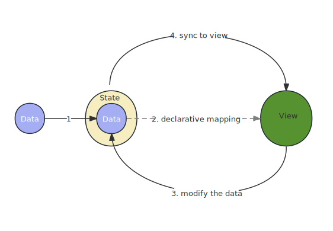

# 快速入门

本章节将为你介绍 Ribir 的全部语法和常用的基本概念。

> 你将了解
>
> - 如何创建和组合 widget
> - 如何响应事件并操作数据
> - 如何让 widget 响应数据变更
> - 如何构建动态 widget
> - 如何将自己的数据结构转变为 widget
> - ? 如何对状态转换和分裂，控制视图更新范围

## 什么是 widget

在 Ribir 中，widget 作为核心概念，它是对视图进行描述的基本单元。在形式上它可以是一个按钮，一个文本框，一个列表，一个对话框，甚至是整个应用界面。在代码上，它可以是一个函数，一个闭包或者一个数据对象。Ribir 将能通过 `&BuildCtx` 构建出 `Widget` 的类型叫做 widget。注意 `Widget` 和 widget 的差别，在整个 Ribir 的语境中，widget 是一个泛称，而大写开头的 `Widget` 是一个具体的 widget，也是所有 widget 构建进入视图的通行证。

如果你不是特别理解上面的话，不用在意，因为你完全不需要关注 widget 的构建过程，Ribir 也禁止干涉这个过程。你只需要明白，Ribir 将所有的 widget 分成四类，并为他们自动实现了 widget 的构建。

- 函数 widget
- `Compose` widget
- `Render` widget
- `ComposeChild` widget

在本章节中，我们将会只介绍函数 widget 和 `Compose` widget。因为在大部分场景中这两种 widget 已经足够满足我们的需求了。作为进阶的内容，我们将在后面的章节中介绍 `Render` widget 和 `ComposeChild` widget。

## 函数 widget

任意一个接收 `&BuildCtx` 作为入参并且返回 `Widget` 的函数或闭包都是一个函数 widget。

在没有外部状态依赖的情况下，通过函数来定义 widget 是最简单的一种 方式。在[创建一个应用](./创建一个应用.md)中，我们已经见过一个 `Hello world!` 的函数 widget 了。本节中，我们仍旧通过 `Hello world!` 来详细介绍函数 widget，看看我们之前使用的 `Hello world!` 例子是如何演变而来的。

### 通过函数来定义 widget

我们先来看一个标准的 `Hello world!` 函数 widget 的例子:

```rust
use ribir::prelude::*;

fn hello_world(ctx!(): &BuildCtx) -> Widget {
  rdl!{ Text { text: "Hello World!" } }
    .widget_build(ctx!())
}

fn main() { 
  App::run(hello_world);
}
```

上面的例子中, 定义了一个 `hello_world` 函数作为 widget。

首先，你应该发现了在函数签名中参数声明（`ctx!(): &BuildCtx`）的特别之处，我们用 `ctx!()` 来作为参数名字，而不是直接给一个名字。这是因为下一行的 `rdl!` 宏会用到`&BuildCtx`，而 `rdl!` 作为一个过程宏，并不知道外部环境的 `&BuildCtx` 的名字，所以 Ribir 统一用 `ctx!()` 来作为 `&BuildCtx` 跨宏传递的名字。而 `ctx!()` 的作用只是简单生成一个特殊名字以避免和上下文冲突。

接下来一行 `rdl!{ Text { text: "Hello World!" } }`，通过 `rdl！` 创建了一个内容为 `Hello World!` 的 `Text`。关于 `rdl!` 的细节，你可以先放到一边，我们将在小节 [使用 `rdl!` 创建和嵌套 widget](#使用-rdl-创建和嵌套-widget) 中详细介绍。

最后，将 `Text` 通过 `widget_build` 方法构建成 `Widget`，作为函数的返回值。

### 闭包和 `fn_widget!`

因为 `hello_world` 并没有被其它人调用，所以你可以将它改写成一个闭包:

```rust
use ribir::prelude::*;

fn main() {
  let hello_world = |ctx!()| {
    rdl!{ Text { text: "Hello World!" } }
      .widget_build(ctx!())
  };
  App::run(hello_world);
}
```

对于通过闭包创建函数控件，Ribir 提供了一个 `fn_widget!` 宏来简化这个过程，`fn_widget!` 除了支持我们本章接下来要讲到的两个语法糖 `@` 和 `$` 之外，你可以简单认为它会这样展开代码：

``` rust ignore
move |ctx!(): &BuildCtx| -> Widget {
  {
    // 你的代码
  }
  .widget_build(ctx!())
}
```

使用 `fn_widget!` 改写 `hello_world` 例子:


```rust
use ribir::prelude::*;

fn main() {
  App::run(fn_widget! { 
    rdl!{ Text { text: "Hello World!" } }
  });
}
```

除了没有使用 `@` 以为，这个例子和你在[创建一个应用](./创建一个应用.md)中看到的已经一样了。

## 使用 `rdl!` 创建对象

`rdl` 是  Ribir Declarative Language 的缩写， `rdl!` 宏的目的就是帮助你以声明式的方式来创建对象。

> 注意：`rdl!` 并不关注类型，只在语法层面做处理，所以并不是只有 widget 才可以用它。

### 声名式创建对象

尽管 `rdl!` 支持任意 Rust 表达式，但我们所说的声名式创建对象，特指一种特别的表达式——即结构体字面量。

当你的表达式是一个结构体字面量时， `rdl!` 会通过 `Declare` trait 来创建对象，这就要求你所创建的对象的类型必须继承或实现了 `Declare` trait。

```rust
use ribir::prelude::*;

#[derive(Declare)]
pub struct Counter {
  #[declare(default = 1)]
  count: usize,
}

let _ = rdl!{ Counter { } };
```

上面的例子中，`Counter` 继承了 `Declare`， 并标记 `count` 默认值为 `1`。 所以在 `rdl!` 中，你可以不用给 `count` 赋值，`rdl!` 创建它时会默认赋值为 `1`。`Declare` 还有一些其它的特性，我们暂不在这里展开。

### 表达式创建对象

除了结构体字面量以外的所有表达式，`rdl!` 仅对它做去语法糖处理，其结果仍旧是原表达式的结果。通常，这种写法只在嵌套 widget 中有必要。

到这里，回顾前文的例子

```rust
use ribir::prelude::*;

fn main() {
  App::run(fn_widget! { 
    rdl!{ Text { text: "Hello World!" } }
  });
}
```
相信你应该已经完全理解它了。

## 内建 widget

Todo

## 组合 widget

你已经知道如何创建一个 widget 了，我们现在通过 widget 嵌套在另一个 widget 中来组合出一个简单的计数应用。

你可以在结构体字面量声明的 widget 中嵌入其它 `rdl!` 作为孩子，注意孩子总是被要求声明在父 widget 属性的后面，这是 `rdl!` 的一个格式强制要求。

```rust
use ribir::prelude::*;

fn main() {
  let counter = fn_widget! { 
    rdl!{ 
      Row {
        align_items: Align::Center,
        rdl!{ FilledButton {
          rdl! { Label::new("Increment") }
        }}
        rdl!{ H1 { text: "0" } }
      }
    }
  };

  App::run(counter);
}
```

上面的例子中，我们创建了一个 `Row`，它有两个孩子，`FilledButton` 和 `H1`。这三种 widget 都是 ribir_widgets 库中已定义好的。

`rdl!` 也允许你为已创建好的 widget 声明孩子: 

```rust
use ribir::prelude::*;

fn main() {
  let counter = fn_widget! {
    let row = rdl!{ Row { align_items: Align::Center } };

    rdl!{ 
      $row {
        rdl!{ FilledButton {
          rdl! { Label::new("Increment") }
        }}
        rdl!{ Text { text: "0" } }
      }
    }
  };

  App::run(counter);
}
```

注意到 `rdl!{ $row { ... } }` 了吗？ 它和结构体字面量语法一样，但是它用 `$` 加上了一个变量名替代了类型，所以它不会新建一个 widget，而是直接使用这个变量来和孩子组合。

> 在 Ribir 中，父子的组合并不是任意的，而是有类型限制的，父亲可以约束孩子的类型并给出组合逻辑。这确保了组合的正确性。
>
> 在我们上面的例子中，`Row` 接收任意数目，任意类型的 widget,`Text` 不能接收任何孩子, 而 `FilledButton` 则更复杂一点，它允许接收一个 `Label` 作为它的文字和一个 `Svg` 作为按钮图标。
>
> 对于如何约束 widget 的孩子类型，我们将在[深入 widget](./深入-widget.md)中详细介绍。


## @ 语法糖

在组合 widget 的过程中，用到了大量的 `rdl!`，这看上去太冗长了，无法让你一眼到重点信息。但另一方面，它又让你在与 Rust 语法交互的例子中（特别是复杂的例子）能有一个清晰的声名式结构——当你看到 `rdl!` 时，你就知道一个 widget 节点的组合和创建开始了。

实际上，Ribir 为 `rdl!` 提供了一个 `@` 语法糖，在实际使用的过程中，基本上用的都是 `@` 而非 `rdl!`。总共有三种情况：

- `@ Row {...}` 作为结构体字面量的语法糖，展开为 `rdl!{ Row {...} }`
- `@ $row {...}` 作为变量结构体字面量的语法糖，展开为 `rdl!{ $row {...} }` 的语法糖
- `@ { ... } ` 是表达式的语法糖，展开为 `rdl!{ ... }` 

现在将上面的计数器例子改写成使用 `@` 语法糖的形式:

```rust
use ribir::prelude::*;

fn main() {
  App::run(fn_widget! {
    @Row {
      @FilledButton {
        @Label::new("Increment")
      }
      @Text { text: "0" }
    }
  });
}
```

## 状态——可被侦听和共享的数据

上面的例子中，你创建了一个计数器，但它总是显示 `0`，而且并没有响应按钮做任何事情。在这一节中，你将会了解到如何通过状态来实现这个功能。

状态是可被侦听和共享的数据，它可以由任意类型的数据装换而来。

`状态 = 数据 + 可侦听 + 可共享`

一个可交互的 Ribir widget 的完整个生命周期是这样的：

1. 将 widget 的驱动源——数据，装换为状态。
2. 对数据进行声名式映射构建出视图。
3. 在交互过程中，通过状态来修改数据。
4. 状态将数据的变更根据其映射关系，直接修改到视图上。
5. 重复步骤 3，4 。



现在，让我们引入状态来改造我们的例子。

```rust
use ribir::prelude::*;

fn main() {
  App::run(fn_widget! {
    // 变更 1: 通过 `State::value` 创建一个状态
    let count = State::value(0);

    @Row {
      @FilledButton {
        // 变更 2： 通过点击事件来修改状态
        on_tap: move |_| *$count.write() += 1,
        @ { Label::new("Increment") }
      }
      // 变更 3： 通过状态来显示数据，并保持视图的持续更新。
      @H1 { text: pipe!($count.to_string()) }
    }
  });
}
```

通过这 3 处变更，计数器的小例子全部完成了。但是在变更 2 和变更 3 中，有新的东西被引入了 —— `$` 和 `pipe!`。让我们用两个小节来分别展开介绍一下，因为它们在使用 Ribir 的过程中非常重要。


## $ 语法糖

在 Ribir 中有两个重要的语法糖，一个是我们之前介绍的 [@ 语法糖](#语法糖)，另一个就是 `$` 语法糖了。`$` 表示对其后的状态数据做读或写引用。

### 状态的读写引用

如果 `$state` 后跟随着 `write()` 或 `silent()` 表示对状态的进行写引用。此时：

- `$state.write()` 即是 `state.write()` 
- `$state.silent()` 即是 `state.silent()`

`write` 和 `silent` 的差别在于，`write` 返回的写引用会触发视图更新，而 `silent` 则不会触发。

如果 `$state` 既没有跟随 `write()` 也没有跟随 `silent()`，则表示对状态的进行读引用。此时:

`$state` 相当于 `state.read()`

### 状态的自动共享

当 `$` 处在一个 `move` 闭包中时，它指向的状态会被自动克隆读/写器完成捕获，因此 `$` 让你可以直接使用一个状态，并轻易的完成共享，而不用去额外的克隆它。


```rust ignore
move |_| *$count.write() += 1
```

大致展开成

```rust ignore
{
  let count = count.clone_writer();
  move |_| *count.write() += 1
}
```

### 语法糖展开的优先级

还记得我们在[组合-widget](#组合-widget)中也同样用到了 `$` 吗？
比如 `rdl!{ $row { ... } }` 或者 `@$row { ... }`，但在这里他可不是对状态数据的引用哦。因为 `rdl!` 赋予了它特殊的语义——通过变量声明父 widget。

在 Ribir 中，无论是 `@` 还是 `$`，它们首先应遵循它们所在宏的语义，其次才是它们作为语法糖的意义。当我们在一个非 Ribir 提供的宏中使用 `@` 或 `$` 时，它们就不再具有作为一个语法糖的意义了，因为外部宏很可能为它们赋予了特殊的意义，即使这个宏被使用在 `fn_widget!` 中。比如：

```rust ignore
use ribir::prelude::*;

fn_widget!{
  user_macro! {
    @Row { ... }
  }
}

```

## `Pipe` 流 —— 保持对数据的持续响应

`Pipe` 流是一个带初始值的持续更新的数据流，它可以被分解为一个初始值和 RxRust 流 —— RxRust 流可以被订阅。它也是 Ribir 将数据变更更新到视图的唯一通道。

Ribir 提供了一个 `pipe!` 宏来辅助你快速创建 `Pipe` 流。它接收一个表达式，并监测表达式中的所有用 `$` 标记出的状态，以此来触发表达式的重算。

比方，下面的例子中, `sum` 是一个 `a`， `b` 之和的 `Pipe` 流。

```rust 
use ribir::prelude::*;

let a = State::value(0);
let b = State::Value(0);

let sum = pipe!($a + $b);
```

在声明一个对象时，你可以通过一个 `Pipe` 流去初始化它的属性，这样它的属性就会持续随着这个 `Pipe` 流变更。如我们在[状态可被侦听和共享的数据）](#状态可被侦听和共享的数据)中见过的：

```rust
  @Text { text: pipe!($count.to_string()) }
```

### 动态渲染不同的 widget

到目前为止，你所有创建的 widget 在视图中都是静态的，它们或者属性会随着数据变更，但 widget 本身不会随着数据而变更。实际上，你同样可以通过 `Pipe` 流来创建持续变化的 widget 结构。

假设你有一个计数器，不过这个计数器不是用文字，而是用红色的小方块来表示数量的：

```rust
use ribir::prelude::*;

fn main() {
  App::run(fn_widget! {
    let count = State::value(0);

    @Row {
      align_items: Align::Center,
      @FilledButton {
        on_tap: move |_| *$count.write() += 1,
        @ { Label::new("Increment") }
      }
      @ { 
        pipe!(0..*$count).map(move |_| {
          @Container {
            margin: EdgeInsets::all(2.),
            size: Size::new(10., 10.),
            background: Color::RED
          }
        })
      }
    }
  });
}
```

### 尽量让 `pipe!` 包含最小的表达式

虽然 `pipe!` 可以包含任意的表达式，但是建议你尽可能在 `pipe!` 中只包含最小表达式，然后使用 `map` 来完成转换。这样可以让你更清晰的看到 `pipe!` 的变更源和避免在复杂的表达式中混入了不必要的依赖。所以，上面例子中写的是

```rust
pipe!(0..*$count).map(move |_| {
  @Container {
    margin: EdgeInsets::all(2.),
    size: Size::new(10., 10.),
    background: Color::RED
  }
})
```

而不是

```rust
pipe!{
  (0..*$count).map(move |_| {
    @Container {
      margin: EdgeInsets::all(2.),
      size: Size::new(10., 10.),
      background: Color::RED
    }
  })
}
```

### 为 `Pipe` 链上 RxRust 的操作符

`Pipe` 流的更新推送是建立在 RxRust 流之上的，所以 `Pipe` 也提供了方法 `value_chain` 让你可以操作 RxRust 流。因此，你可以使用 RxRust 的操作符来如 `filter`, `debounce` `distinct_until_change` 等等操作来减少更新的频率。

假设你有一个简单的自动求和的计算器：

```rust
use ribir::prelude::*;

fn main() {
  App::run(fn_widget! {
    let a = State::value(0);
    let b = State::value(0);

    @Column {
      align_items: Align::Center,
      @Text { text: pipe!($a.to_string()) }
      @Text { text: pipe!($b.to_string()) }
      @Text {
        text: pipe!((*$a + *$b).to_string())
          .value_chain(|s| s.distinct_until_changed()),
        on_tap: move |_| {
          *$a.write() +=1;
          *$b.write() -=1;
        }
      }
    }
  });
}
```

在上面的例子中， 前面两个 `Text` 会随着 `a` 和 `b` 的修改而更新，即使 `a` 和 `b` 的值没有发生变化——比如对其设同样的值。而最后一个 `Text` 通过 `distinct_until_changed` 来过滤掉重复的更新，只有当 `a` , `b` 之和的结果发生变化时，它才会更新。

因此，当我们点击最后一个 `Text` 时，只有前面两个 `Text` 会进行视图更新，而最后一个 `Text` 不会更新。


> 小贴士
>
> 一般来讲，想知道视图哪部分是动态变化的，你只需要查找哪里有 `pipe!`。


## `watch!` 侦听表达式的变更

`watch!` 与 `pipe!` 非常相似，但 `watch!` 没有初始值，它直接返回一个可被监听的 RxRust 流。它与 `pipe!` 有着相同的语法。

你也可以用 `watch!` 来手动实现你的计数器：
  
```rust
use ribir::prelude::*;

fn main() {
  App::run(fn_widget! {
    let count = State::value(0);
    let display = @H1 { text: "0" };
    watch!(*$count).subscribe(move |v| {
      $display.write().text = v.to_string().into();
    });

    @Row {
      align_items: Align::Center,
      @FilledButton {
        on_tap: move |_| *$count.write() += 1,
        @ { Label::new("Increment") }
      }
      @{ display }
    }
  });
}
```

## `Compose` widget —— 描述你的数据结构

## ?状态的转换、分裂和溯源